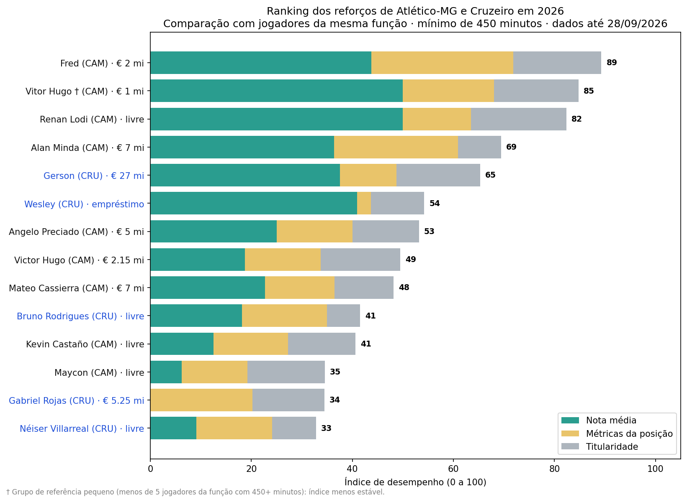
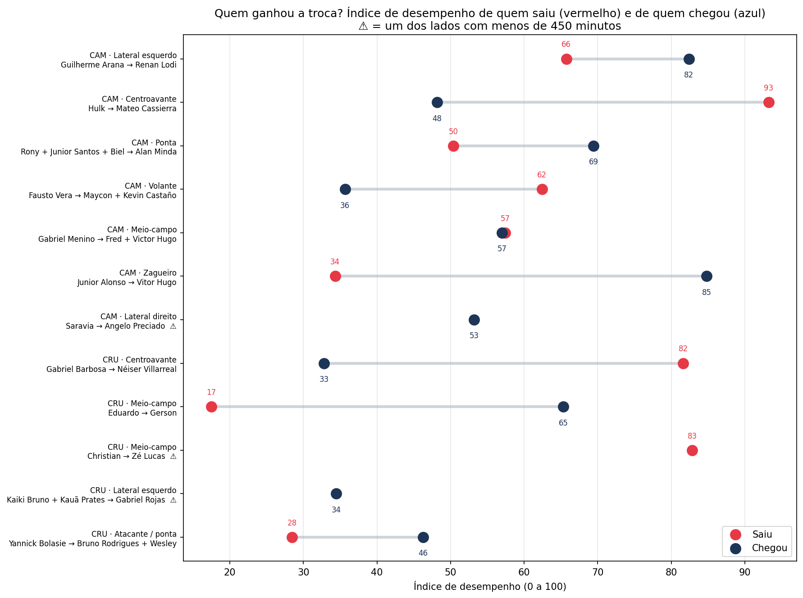
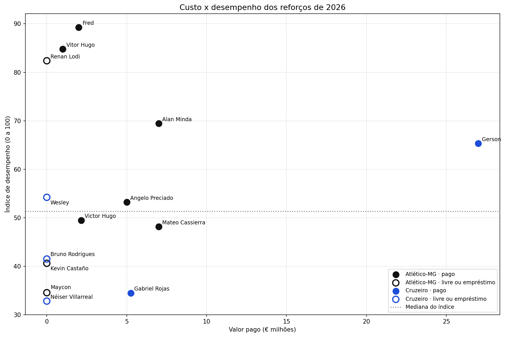
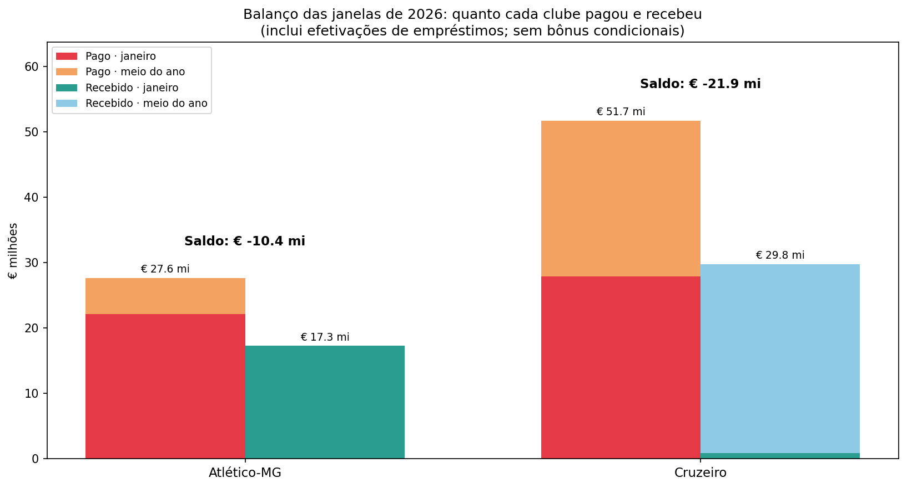

# Reforços e saídas de Atlético-MG e Cruzeiro em 2026

Quem foram os melhores reforços dos dois clubes de Belo Horizonte em 2026? Os jogadores que saíram estão rendendo mais ou menos do que os que chegaram? E quanto custou cada contratação em relação ao que entregou em campo?

Este projeto analisa **todas as movimentações das duas janelas de transferência de 2026** de Atlético-MG e Cruzeiro, cruzando valores pagos e recebidos com estatísticas por 90 minutos e notas de desempenho.

> Dados coletados em **28/09/2026** (Sofascore e FotMob, todas as competições). Valores em **€ milhões**.
>
> Projeto anterior: [Dinheiro e Desempenho no Brasileirão 2026](https://github.com/enriquefroes/futebol-dinheiro-e-desempenho)

---

## Perguntas

| Notebook | Pergunta |
|---|---|
| `01_ranking_reforcos` | Quais foram os melhores reforços, comparados com jogadores da mesma função? |
| `02_quem_ganhou_a_troca` | Quem rendeu mais: o jogador que saiu ou o que chegou para a mesma função? |
| `03_custo_beneficio` | O valor pago se traduziu em desempenho? Quanto custou cada gol ou assistência? |
| `04_balanco_janelas` | Quanto cada clube pagou, recebeu e qual o saldo das janelas? |

---

## Principais resultados

### 1. Os jogadores mais produtivos de 2026 são os que saíram

Os dois maiores índices de participação em gol por 90 minutos de todo o projeto pertencem a jogadores que **deixaram os clubes sem custo**:

| Jogador | Saiu de | Clube atual | Gols + assistências por 90 min |
|---|---|---|---|
| Hulk | Atlético-MG | Fluminense | 1,00 |
| Gabriel Barbosa | Cruzeiro | Santos | 0,88 |

### 2. O Atlético domina o ranking de reforços



| | Jogador | Clube | Custo | Índice |
|---|---|---|---|---|
| 1 | Fred | Atlético-MG | € 2 mi | 89 |
| 2 | Vitor Hugo † | Atlético-MG | € 1 mi | 85 |
| 3 | Renan Lodi | Atlético-MG | livre | 82 |
| 4 | Alan Minda | Atlético-MG | € 7 mi | 69 |
| 5 | Gerson | Cruzeiro | € 27 mi | 65 |

† Função com poucos jogadores de referência (ver Limitações).

### 3. Quem ganhou a troca



| Clube | Função | Saiu → Chegou | Índice (saiu × chegou) | Veredito |
|---|---|---|---|---|
| Atlético-MG | Lateral esquerdo | Guilherme Arana → Renan Lodi | 66 × 82 | Chegada rendeu mais |
| Atlético-MG | Centroavante | Hulk → Mateo Cassierra | 93 × 48 | Saída rendeu mais |
| Atlético-MG | Ponta | Rony, Junior Santos e Biel → Alan Minda | 50 × 69 | Chegada rendeu mais |
| Atlético-MG | Volante | Fausto Vera → Maycon e Kevin Castaño | 62 × 36 | Saída rendeu mais |
| Atlético-MG | Meio-campo | Gabriel Menino → Fred e Victor Hugo | 57 × 57 | Equilibrado |
| Atlético-MG | Zagueiro | Junior Alonso → Vitor Hugo | 34 × 85 | Chegada rendeu mais |
| Atlético-MG | Lateral direito | Saravia → Angelo Preciado | — × 53 | Inconclusivo |
| Cruzeiro | Centroavante | Gabriel Barbosa → Néiser Villarreal | 82 × 33 | Saída rendeu mais |
| Cruzeiro | Meio-campo | Eduardo → Gerson | 17 × 65 | Chegada rendeu mais |
| Cruzeiro | Meio-campo | Christian → Zé Lucas | 83 × — | Inconclusivo |
| Cruzeiro | Lateral esquerdo | Kaiki Bruno e Kauã Prates → Gabriel Rojas | — × 34 | Inconclusivo |
| Cruzeiro | Atacante / ponta | Yannick Bolasie → Bruno Rodrigues e Wesley | 28 × 46 | Chegada rendeu mais |

**Resumo:** a chegada rendeu mais em 5 grupos, a saída em 3, houve 1 empate e 3 ficaram inconclusivos por amostra pequena. As duas saídas de maior impacto foram as dos centroavantes: Hulk e Gabriel Barbosa.

### 4. Pagar funcionou na média, mas com exceções



- Reforços **pagos** tiveram índice médio de **62**; os **livres e emprestados**, de **48**.
- A maior exceção é **Renan Lodi**: chegou livre e é o 3º melhor reforço.
- **Gerson**, contratação mais cara dos dois clubes, custou € 4,5 mi por participação em gol. Essa métrica, porém, não capta o trabalho de um meio-campista de construção: nas notas, ele é um dos melhores do grupo, e seu índice (65) é o maior entre os reforços do Cruzeiro.

### 5. Balanço das janelas



| | Atlético-MG | Cruzeiro |
|---|---|---|
| Pago | € 27,65 mi | € 51,70 mi |
| Recebido | € 17,27 mi | € 29,76 mi |
| **Saldo** | **− € 10,4 mi** | **− € 21,9 mi** |

O Cruzeiro gastou quase o dobro, mas também vendeu bem no meio do ano: Kaiki Bruno, Christian e Kauã Prates somaram € 28,6 mi. Se o bônus de € 2 mi da venda de Kaiki for atingido, o saldo cai para − € 19,9 mi.

---

## Metodologia

### Dados

- **Transferências:** todas as chegadas e saídas das duas janelas de 2026, com valores divulgados em € milhões, compilados pelo autor.
- **Estatísticas:** Sofascore, **todas as competições de 2026**, coletadas em 28/09/2026. Para os jogadores que saíram, apenas os números **pelo clube atual**.
- **Notas:** média de 2026 no **Sofascore** e no **FotMob**. As duas plataformas mostraram alta concordância entre si (correlação de 0,80).

### Critérios de inclusão

- **Mínimo de 450 minutos** (o equivalente a cinco jogos completos) para entrar nas comparações de desempenho. Abaixo disso, as estatísticas por 90 minutos se tornam instáveis.
- **Efetivações de empréstimos** entram nos valores financeiros, mas **não na análise de desempenho**, pois a mudança no elenco ocorreu antes de 2026:
  - Chegadas: Ruan Tressoldi, Luis Sinisterra e Fágner.
  - Saídas: Zé Ivaldo, Brahian Palacios, Bruno Fuchs, Matheus Mendes e Lautaro Díaz.
- **Renovações de empréstimo** (Robert e Paulo Vitor) foram excluídas.
- **Jogadores sem minutos** (Léo Duarte, Matías Viña e Patrick) aparecem na base, mas fora das análises.

### Grupos de posição e métricas

Cada jogador é comparado apenas com jogadores da mesma função. Todas as métricas são calculadas **por 90 minutos**.

| Grupo | Posições | Métricas |
|---|---|---|
| Ataque | ATA, PD/PE | gols + assistências, xG + xA, passes decisivos, dribles certos |
| Meio-campo | MC, MEI | gols + assistências, passes decisivos, passes certos, desarmes, interceptações |
| Laterais | LD, LE | gols + assistências, passes decisivos, cruzamentos certos, desarmes, interceptações |
| Zagueiros | ZAG | desarmes, interceptações, chutes bloqueados, duelos aéreos vencidos, passes certos |

Legenda: ATA = atacante · PD/PE = ponta · MC = meio-campista · MEI = meia atacante · LD/LE = lateral direito/esquerdo · ZAG = zagueiro · GOL = goleiro.

### Índice de desempenho (0 a 100)

| Componente | Peso | Cálculo |
|---|---|---|
| Nota | 50% | Nota média (Sofascore + FotMob) ÷ 2, convertida em posição relativa dentro do grupo |
| Métricas da posição | 30% | Média das posições relativas em cada métrica do grupo |
| Titularidade | 20% | Minutos por jogo ÷ 90 (limitado a 1) |

A **posição relativa** vai de 0 (pior do grupo) a 1 (melhor do grupo). O grupo de referência inclui **reforços e saídas** dos dois clubes com pelo menos 450 minutos, o que aumenta a base de comparação. Os pesos ficam no parâmetro `PESOS` dos notebooks e podem ser alterados.

### Nota média e nota padronizada

A planilha do projeto traz duas versões das notas:

- **Nota média:** (Sofascore + FotMob) ÷ 2. É a usada no índice.
- **Nota padronizada:** ajusta cada plataforma pela sua própria variação (média dos desvios em relação à média do grupo, em desvios-padrão). Serve como checagem: o ranking resultante é praticamente idêntico ao da nota média (correlação de 0,998).

### Comparação "quem ganhou a troca"

- Os **12 grupos** foram definidos pelo autor, com base na função que cada jogador ocupou no time (arquivo `pares.csv`).
- Quando há mais de um jogador de um lado, os minutos, gols e assistências são **somados**, e a nota e o índice são **ponderados pelos minutos** de cada um.
- **Veredito:** diferença de índice maior que 5 pontos indica qual lado rendeu mais; até 5 pontos, "equilibrado"; se algum lado tem jogador com menos de 450 minutos, "inconclusivo".

### Custo por participação em gol

Calculado apenas para **compras** com pelo menos um gol ou assistência. Jogadores livres e emprestados sem taxa aparecem nos gráficos de desempenho, mas não nessa métrica.

---

## Limitações

- **Sensibilidade do índice a notas próximas.** O índice usa a posição relativa dentro de cada função. Em grupos com notas muito próximas (como o meio-campo, com notas entre 6,77 e 7,18), pequenas diferenças de nota podem gerar diferenças maiores no índice. Os vereditos devem ser lidos junto com os números brutos. Exemplo: no grupo dos volantes, Fausto Vera tem nota apenas 0,07 maior que Kevin Castaño, mas fica bem à frente no índice.
- **Grupos de referência pequenos.** Os zagueiros são comparados apenas entre Vitor Hugo, Tressoldi e Junior Alonso, o que torna o índice de Vitor Hugo (marcado com †) menos estável.
- **Goleiros fora do ranking.** Só há um goleiro entre os reforços (Matheus Cunha, que também saiu no mesmo ano), sem outro para comparação. Ele foi excluído dos pares. Registro à parte: no Cruzeiro, sofreu 5,3 gols a mais do que o esperado; no Internacional, está na média.
- **Amostras curtas.** Fred lidera o ranking com 627 minutos, e Wesley está logo acima do corte, com 476. São os números mais sujeitos a mudar.
- **Ligas diferentes.** Jogadores que saíram atuam em ligas de níveis e coberturas distintas, o que afeta estatísticas e notas.
- **Christian (Krasnodar).** A liga russa tem cobertura de dados reduzida devido às sanções decorrentes da guerra, e as duas plataformas divergem bastante sobre ele (6,92 × 7,44). Seus números devem ser lidos com cautela.
- **Períodos parciais.** Os números de Hulk são apenas do período no Fluminense, e os de Biel somam dois clubes em 2026.
- **Valores de transferência** são os divulgados publicamente e podem não incluir bônus, comissões e parcelas condicionais.

---

## Como rodar

1. Abra o [Google Colab](https://colab.research.google.com) e faça upload de `notebooks/00_dados.ipynb`.
2. Rode todas as células e autorize o acesso ao Google Drive. O notebook cria a pasta `MeuDrive/analise_reforcos_galo_cruzeiro/` com os três arquivos de dados.
3. Rode qualquer um dos notebooks 01 a 04. Gráficos e tabelas são salvos nas pastas `graficos/` e `tabelas/`.

Os notebooks também funcionam fora do Colab (Jupyter local). Bibliotecas: `pandas`, `numpy`, `matplotlib`.

## Estrutura

```
├── notebooks/   00_dados + 4 análises
├── dados/       transferencias.csv, estatisticas.csv, pares.csv e a planilha completa (.xlsx)
├── graficos/    PNGs gerados pelos notebooks
└── tabelas/     CSVs com os resultados de cada análise
```


---

**Autor:** Enrique Froes Nepomuceno · [LinkedIn](https://www.linkedin.com/in/enrique-froes-nepomuceno) · Projeto de estudo em análise de futebol e mercado de transferências.
